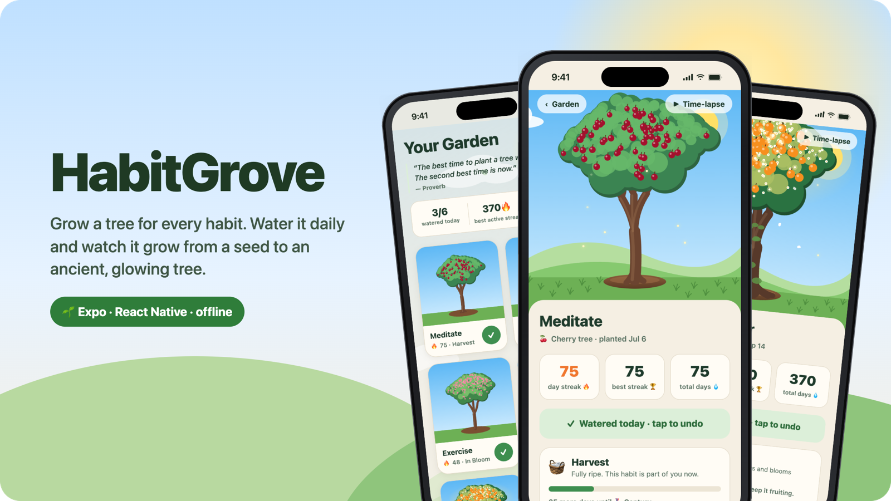
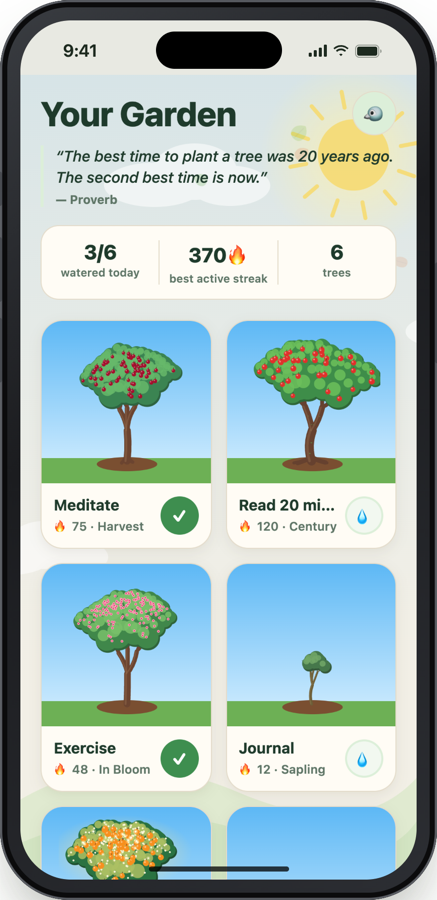
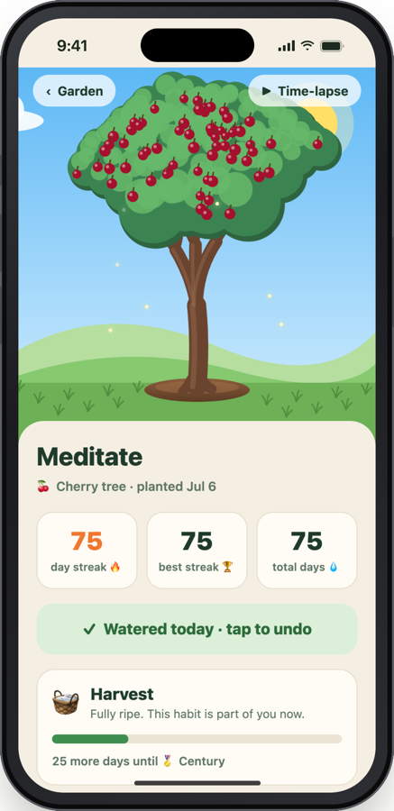
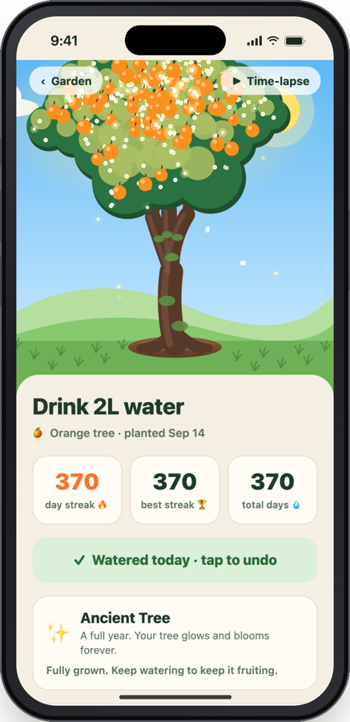
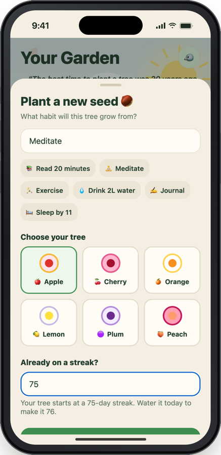
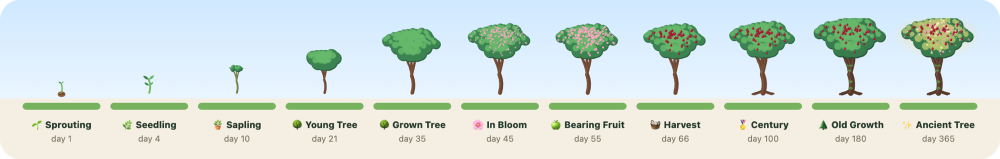

<p align="center">
  
</p>

<h1 align="center">HabitGrove</h1>

<p align="center">
  <b>Grow a tree for every habit.</b><br/>
  Water it each day you show up, and watch it grow from a seed to an ancient, glowing tree.
</p>

<p align="center">
  
  
  
  
  
</p>

<p align="center">
  
</p>

---

## ✨ Features

- 🌳 **A living tree per habit.** Every tree is drawn procedurally in SVG, so no two look the same. It sprouts, branches, blossoms and fruits as your streak grows.
- 💧 **One tap to water.** Check in from the garden or the tree's own screen. A rain animation and haptics make each check-in feel good.
- 🗓️ **Forgot a day? Fill it in.** The five-week calendar lets you tap past days to mark them done.
- 🔥 **Bring your existing streak.** When you plant a habit, enter how many days you've already done and the tree starts at that stage.
- 🏅 **Milestones past day 66.** Surface roots at 100 days, moss and a deeper canopy at 180, and a golden glow at 365.
- 🌅 **A sky that follows the clock.** Dawn, day, dusk and night skies, with clouds, stars, falling petals and optional garden sounds.
- ⏩ **Time-lapse.** Replay your tree growing from a seed to where it is today.
- 🔔 **Daily reminders.** Get a local notification at a time you choose. Trees you've already watered stay quiet.
- 🔒 **Private by design.** No account and no server. Everything stays on your phone.

## 📱 Screens

<table>
  <tr>
    <td align="center"></td>
    <td align="center"></td>
    <td align="center"></td>
    <td align="center"></td>
  </tr>
  <tr>
    <td align="center"><b>Your garden</b><br/><sub>Every habit at a glance</sub></td>
    <td align="center"><b>75-day streak</b><br/><sub>Harvest, 25 days to Century</sub></td>
    <td align="center"><b>Ancient Tree</b><br/><sub>A full year of watering</sub></td>
    <td align="center"><b>Plant a seed</b><br/><sub>Carry over an existing streak</sub></td>
  </tr>
</table>

## 🌱 The growth journey

<p align="center">
  
</p>

| Day | Stage | What happens |
|---:|---|---|
| 0 | 🌰 Seed | Planted and waiting |
| 1 | 🌱 Sprouting | A tiny shoot breaks through the soil |
| 4 | 🌿 Seedling | First true leaves |
| 10 | 🪴 Sapling | A slender trunk forms |
| 21 | 🌳 Young Tree | Branches spread and the canopy fills in |
| 35 | 🌳 Grown Tree | Strong roots. The habit is taking hold |
| 45 | 🌸 In Bloom | Covered in blossoms |
| 55 | 🍏 Bearing Fruit | Blossoms turn into fruit |
| 66 | 🧺 Harvest | Fully ripe. It takes 66 days on average for a habit to become automatic |
| 100 | 🏅 Century | Roots spread wide and the trunk grows stout |
| 180 | 🌲 Old Growth | Moss on the bark and a deep, broad canopy |
| 365 | ✨ Ancient Tree | A golden glow, sparkles, and blossoms that come back |

Your streak counts consecutive days ending today. If you haven't watered yet today, a streak that ended yesterday still counts.

## 🚀 Getting started

```bash
npm install
npx expo start          # scan the QR code with Expo Go
npm run android         # or build and run on a device or emulator
npm run ios
```

### Build an APK

```bash
npx expo prebuild --platform android   # re-sync android/ after changing app.json, icons or the splash
eas build -p android --profile preview
```

> [!IMPORTANT]
> Your habits are stored on the device. Install new builds **over** the old app, and keep the same package name (`com.habitgrove.app`) and signing key. Uninstalling the app deletes its data.

## 🗂️ Project structure

```
App.tsx                  navigation between the garden and a tree, native splash, reminders
src/
  store.ts               habits persisted with AsyncStorage (key: habitgrove/habits/v1)
  dates.ts               day keys and streak maths
  growth.ts              species, growth stages, streak → growth parameters
  components/
    Tree.tsx             procedural SVG tree: branches, canopy, blossoms, fruit, roots, moss, glow
    Scene.tsx            sky, sun or moon, hills, rain, petals and sway around the tree
    GardenBackdrop.tsx   garden background
    ReminderCard.tsx     daily reminder picker
    UprootConfirm.tsx    delete confirmation
  screens/
    GardenScreen.tsx     grid of trees with quick watering
    HabitScreen.tsx      a single tree: stats, milestones, calendar, time-lapse
    PlantSheet.tsx       plant a new habit, optionally with an existing streak
  reminders.ts           local notifications
  ambience.ts, sfx.ts    garden ambience and sound effects
scripts/                 generators for icons, the splash image and audio
```

## 🛠️ Built with

[Expo](https://expo.dev) · [React Native](https://reactnative.dev) · [react-native-svg](https://github.com/software-mansion/react-native-svg) · AsyncStorage · expo-notifications · expo-audio · expo-haptics

---

<p align="center"><sub>Plant a seed. Show up tomorrow. 🌳</sub></p>
